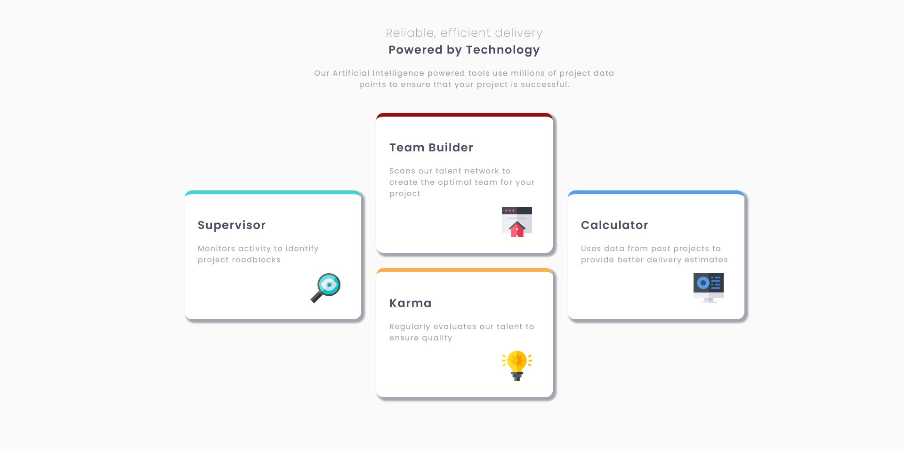

# Frontend Mentor - Four card feature section solution

This is a solution to the [Four card feature section challenge on Frontend Mentor](https://www.frontendmentor.io/challenges/four-card-feature-section-weK1eFYK). Frontend Mentor challenges help you improve your coding skills by building realistic projects. 

## Table of contents

-## Overview

### Screenshot

### Links

- [GitHub Pages] 
- [GitHub Code]

### Continued development

I would like to continue the front-end development, to improve my knowledges in order to be able to create more complex websites. 
Still have issues in correctly structuring a HTML page, to follow the correct flow, the correct semantics. The right one in the right place. 

### Useful resources

-Mozilla Developer https://developer.mozilla.org/en-US/docs/Learn - this helped me to understand the structure of a HTML document and to style it using CSS. 
-w3schools https://www.w3schools.com/ - a second really good source to answer your questions regarding HTML and CSS but not only. I am trying to check multiple sources regarding the same question. 
-CSS-tricks https://css-tricks.com/snippets/css/complete-guide-grid/ - strongly recomend for a easy and complete understand of CSS Grid layout. Really well structured and self explanatory. 

## My process

- initialy created the mobile first layout
- for CSS part strucuture the folder in general structure, and then more particular layout, trying not to repeat code
- adapt the structure for big devices, more 1200px; 

### Built with

- Semantic HTML5 markup
- CSS 
- Flexbox
- Grid 
- Mobile-first workflow

